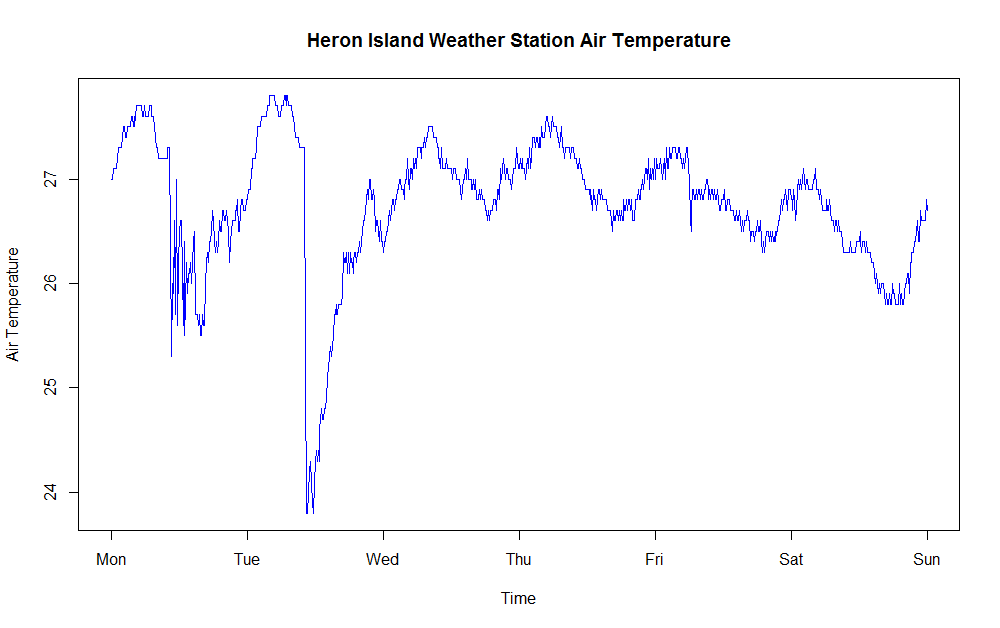

AIMS DataPlatform R Client
==========================

__AIMS DataPlatform R Client__ will provide easy access to data sets for R applications to the __AIMS DataPlatform API__.

Installation
------------

Details on installation of __AIMS DataPlatform R Client__ are [here](install).

Available Data Sets
-------------------

The __AIMS DataPlatform API__ is a *REST API* providing *JSON* formatted data.  The __AIMS DataPlatform API__ should be queried using the Digital Object Identifier ([DOI](https://doi.org)) of the desired data set.  At this time available data sets are:

Data Set                 | DOI                    | Documentation                                   | Resolve DOI
-------------------------|------------------------|-------------------------------------------------|-------------------------------------------------------------------------
AIMS Weather             | 10.25845/5c09bf93f315d | [AIMS Weather](weather)                         | [AIMS Weather](https://doi.org/10.25845/5c09bf93f315d){:target="_blank"}
AIMS Temperature Loggers | 10.25845/5b4eb0f9bb848 | [AIMS Temperature Loggers](temperature-loggers) | [AIMS Temperature Loggers](https://doi.org/10.25845/5b4eb0f9bb848){:target="_blank"}

Examples usage of data request using query filter parameters with R client:

```
> library(aimsdataplatform)

> getData('10.25845/5c09bf93f315d', filters=list('site-name'='Davies Reef', 'parameter'='Wind Direction (Scalar Average 10 Minutes)', 'size'=10))

> getData('10.25845/5c09bf93f315d', filters=list('site-name'='Square Rocks', 'series'=104939, 'size'=10))

> getAllData('10.25845/5c09bf93f315d', filters=list('site-name'='Davies Reef', 'size'=10000)

```

Example usage of data series download and plot
----------------------------------------------

Suppose we want to query a data series and plot it then the procedure might be:
1. Examine documentation and establish query filters
2. Perform data download using `getAllData`
3. Use R `plot` to create a chart

We decide to query the [AIMS Weather](weather) data set based on a data series, then we are guaranteed of getting information from one site for one metric.  Our filters might look like the following:


Variable  | Value        | Description
----------|--------------|------------
series    | 189          | Found [here](weather/series), Heron Island Air Temperature data series
size      | 1000         | Fetching 1000 rows of data per request
from-date | '2018-01-01' | We want to start charting on 1/1/2018
thru-date | '2018-01-07' | We are plotting 7 days of data

Then our query and plot might look like the following:

```
> library(aimsdataplatform)

> dataFrame <- getAllData("10.25845/5c09bf93f315d", filters=list('series'=189, 'size'=1000, 'from-date'='2018-01-01', 'thru-date'='2018-01-07'))
[1] "Cite this data as: Australian Institute of Marine Science (AIMS). 2009, Australian Institute of Marine Science Automatic Weather Stations, https://doi.org/10.25845/5c09bf93f315d, accessed 14 August 2019.  Time period: 2018-01-01 to 2018-01-07.  Series: Heron Island Weather Station Air Temperature"
[1] "Result count: 865"

> plot(dataFrame$results$time, dataFrame$results$qc_value, xlab="Time", ylab="Air Temperature", col="blue", main="Heron Island Weather Station Air Temperature", type="l")

```


